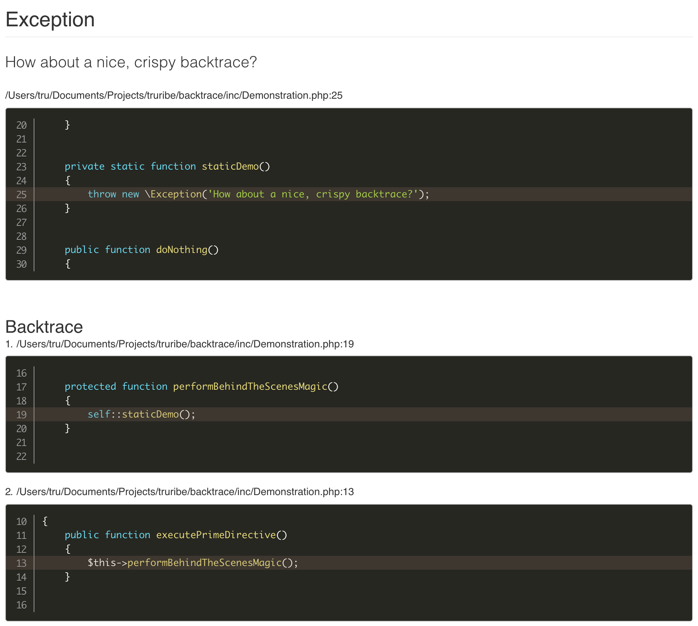
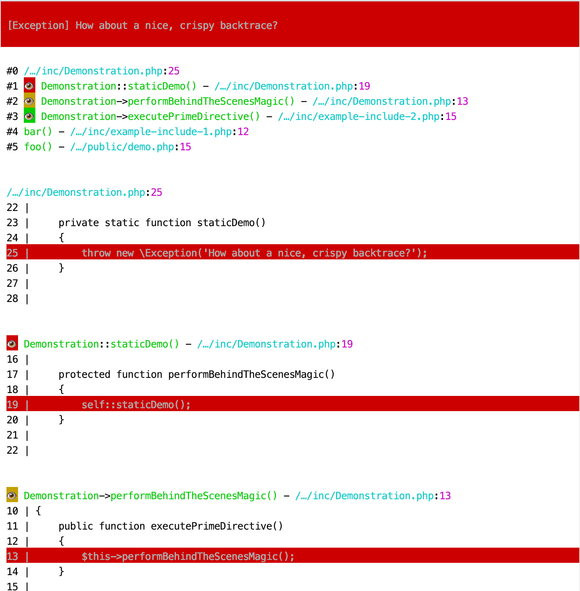

# Backtrace
Get useful error messages with file previews and syntax highlighting.


In CLI mode or in the context of AJAX requests you'll get a simplified
plaintext backtrace like this:


## Installation
Install via `composer`:
```bash
composer require --dev tvanc/backtrace @dev
```

## Coming Soon
- More sophisticated CLI formatting.
- A dedicated plaintext format, to be used within AJAX requests (by default).
- Arguments in the backtrace.

## Usage
Display an error message and backtrace for exceptions, with the optimal
format automatically selected according to the environment in which the error
or exception is thrown.

```php
use tvanc\backtrace\Backtrace;

// Register a listener that detects your environment type and automatically
// selects the appropriate format to use for rendering errors.
Backtrace::createListener()->listen();
```

